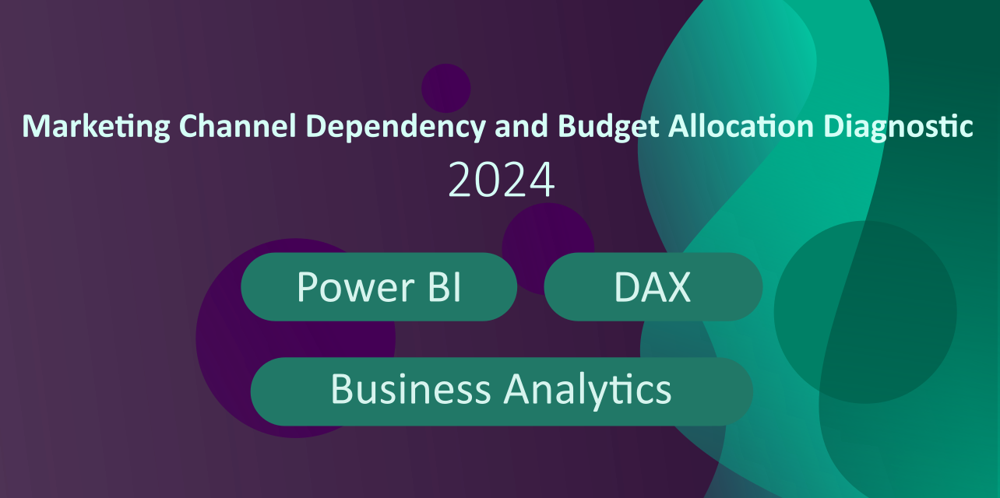
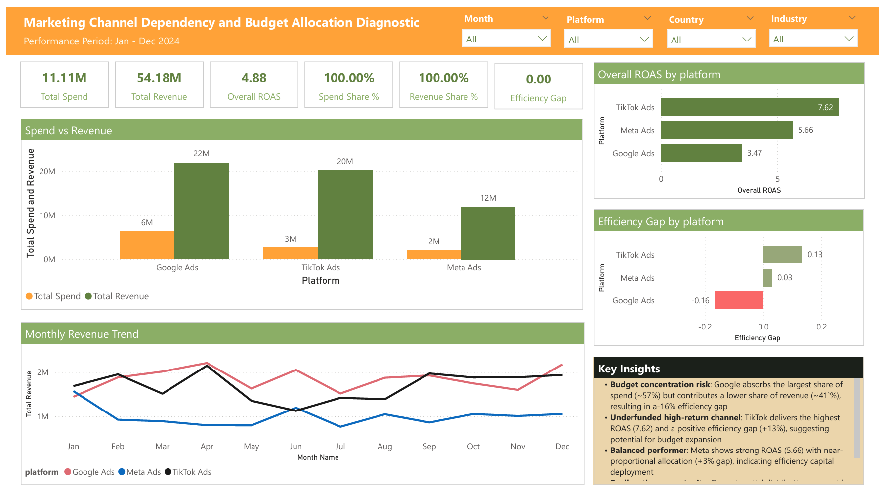
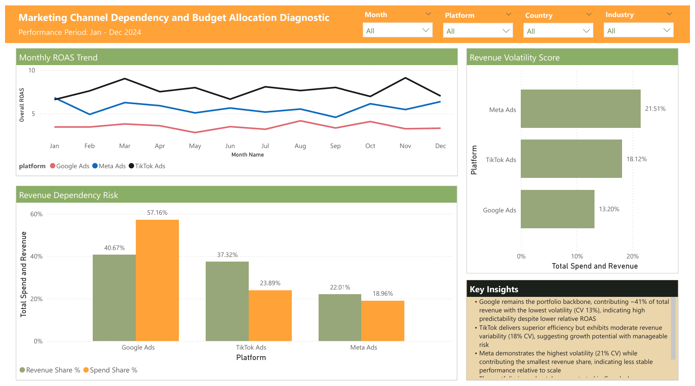
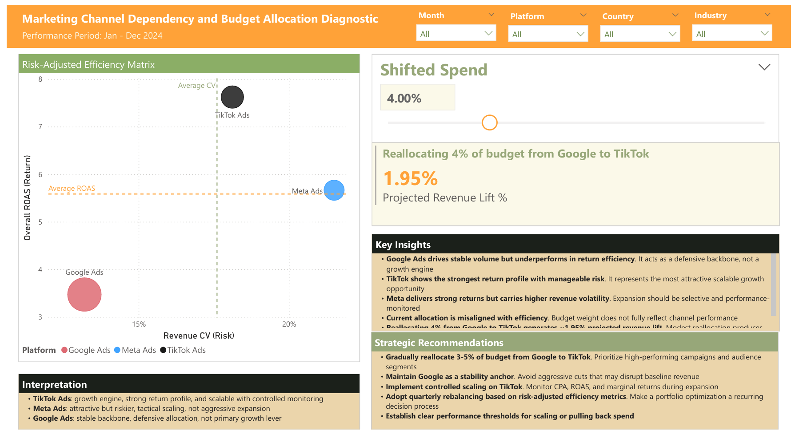

## Marketing Channel Dependency and Budget Allocation Diagnostic (2024)

### Business Question
#### Are marketing budgets allocated efficiently across channels, and where should spend be shifted to improve returns?

### Dataset
[Global Ads Performance (Google, Meta, TikTok)](https://www.kaggle.com/datasets/nudratabbas/global-ads-performance-google-meta-tiktok)

### Tools
- Power BI
- Power Query (M)
- DAX

### Dashboard Pages
1. Performance Efficiency

### Key Insights
Page 1:
- Budget concentration risk: Google absorbs the largest share of spend (~57%) but contributes a lower share of revenue (~41`%), resulting in a-16% efficiency gap
- Underfunded high-return channel: TikTok delivers the highest ROAS (7.62) and a positive efficiency gap (+13%), suggesting potential for budget expansion
- Balanced performer: Meta shows strong ROAS (5.66) with near-proportional allocation (+3% gap), indicating efficiency capital deployment
- Reallocation opportunity: Current capital distribution may not be optimized for return maximization; reallocation budget toward higher-efficiency channels could improve portfolio-level ROAS

2. Channel Stability and Dependency Risk

### Key Insights
Page 2:
- Google remains the portfolio backbone, contributing ~41% of total revenue with the lowest volatility (CV 13%), indicating high predictability despite lower relative ROAS
- TikTok delivers superior efficiency but exhibits moderate revenue variability (18% CV), suggesting growth potential with manageable risk
- Meta demonstrates the highest volatility (21% CV) while contributing the smallest revenue share, indicating less stable performance relative to scale
- The portfolio is moderately concentrated in Google, however, diversification across channels mitigates single-platform dependency risk

3. Strategic Budget Reallocation and Portfolio Optimization

### Key Insights
Page 3:
- TikTok Ads: growth engine, strong return profile, and scalable with controlled monitoring
- Meta Ads: attractive but riskier, tactical scaling, not aggressive expansion
- Google Ads: stable backbone, defensive allocation, not primary growth lever
- Google Ads drives stable volume but underperforms in return efficiency. It acts as a defensive backbone, not a growth engine
- TikTok shows the strongest return profile with manageable risk. It represents the most attractive scalable growth opportunity
- Meta delivers strong returns but carries higher revenue volatility. Expansion should be selective and performance-monitored
- Current allocation is misaligned with efficiency. Budget weight does not fully reflect channel performance
- Reallocating 4% from Google to TikTok generates ~1.95% projected revenue lift. Modest reallocation produces measurable upside without increasing total spend

### Strategic Recommendations
- Gradually reallocate 3-5% of budget from Google to TikTok. Prioritize high-performing campaigns and audience segments
- Maintain Google as a stability anchor. Avoid aggressive cuts that may disrupt baseline revenue
- Implement controlled scaling on TikTok. Monitor CPA, ROAS, and marginal returns during expansion
- Adopt quarterly rebalancing based on risk-adjusted efficiency metrics. Make a portfolio optimization a recurring decision process
- Establish clear performance thresholds for scaling or pulling back spend
